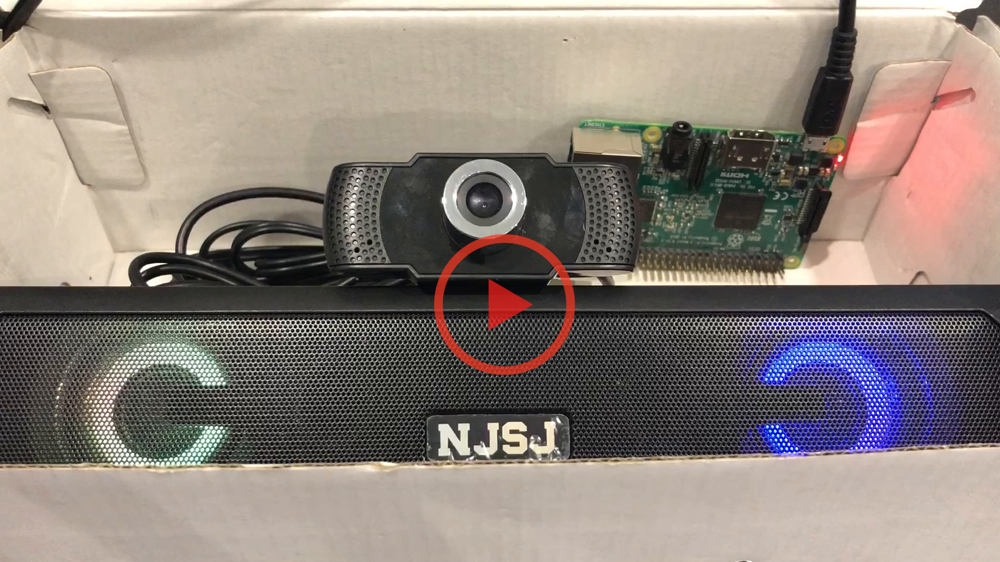
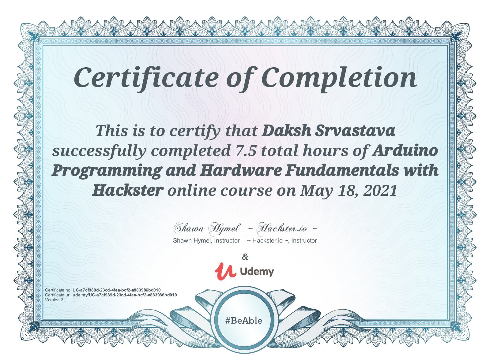

# My Top 5 Projects

Here is a ranked list of my 5 best coding projects:

### 1. Translator

I have created a compact, handheld device that hears spoken words in a conversation, translates them and 
speaks to them in a language the listener can understand. Powered by the latest Google Cloud AI Speech 
Recognition and Synthesis technology, it is reliable and accurate. It is two-way, translating English 
words to Ukrainian and Ukrainian to English. This allows it to support full conversations.

The inner workings of the device are simple. The prototype’s hardware uses a Raspberry Pi 3B for its 
computer, a mini soundbar for its speakers, and an old webcam for the microphone. The software is also 
simple. It has three sections: speech to text, translation, and text to speech. All of it is powered by 
Google and coded in Python. My dev
It is a screen-free alternative to a smartphone app, with the added benefit of speaking out the words. 
This allows Ukrainian refugees to connect with those around them quickly and comfortably. Currently, the 
device is in its prototype phase. Once released, it will be cheap and inexpensive, so refugees who face 
poverty will be able to use this device.

### 2. Classroom App

In this project, I have created an app that teachers can use to manage their classrooms. There are 2 versions I coded: ReactJS and Flutter. 
Users can create accounts and log in to their account. Students can join and deregister from classes and teachers can create, edit, and delete classrooms. It extends up to the assignment level, where students can view and submit assignments, and teachers can create, edit, and delete assignments. If a teacher wants to view submission statuses of students, they can view a report that organizes students and assignments into a neat table. That is how the classroom app works.

### 3. Arduino Programming Course

I have completed the Arduino Programming and Hardware Fundamentals course by Shawn Hymel on udemy. It is a fun, instructive course with many hardware activities. 

### 4. Trivia Game

In this project, I have created an online multiplayer trivia game using FastAPI, React, and MongoDB. It 
is asynchronous, so once a game is created, players who have the link can submit their answers and see 
their ranking when the game ends. It supports two functions: creating a question and creating a game. A 
question asks for the question, it's responses, the correct answer, and the category. When someone wants 
to start a game, my web application chooses a random set of questions from the specified category and 
starts the game.

### 5. Price Tracker

In this project, I have created a web application using FastAPI, React, Planetscale, and Vercel. It can track the price oif any amazon product, and email the user when the price drops below a certain threshold. It is composed of a single-page React frontend, which interacts with the backend. The backend has 3 routes: one for testing, one for creation, and one for deletion. The code that checks the price and does the emailing runs separately as a cron job. All these were integrated in Vercel. I learned how to use MySQL database and how to deploy a project on Vercel.

A list of all my projects can be found here: [Link to my GitHub Page](https://github.com/dakshsriv/)
